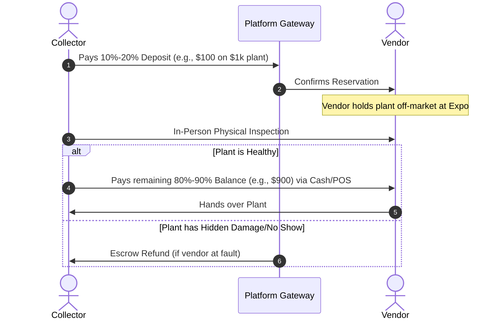

# 🌿 Collector Club: Tiered Membership & Financial Escrow System

## 🎯 Executive Summary & Strategy
The botanical directory introduces a highly targeted, collector-facing paywall strictly for transactional privileges. 
To drive massive **SEO** and **top-of-funnel organic traffic**, critical public-facing features remain completely free. However, engaging in high-value transactions requires verification and a premium pass to protect both buyers and sellers.

* **Free Experience:** Browsing the vendor directory, viewing genetic profiles, and accessing physical expo maps is open to everyone.
* **Premium Experience:** Unlocking physical-event reservations, early presales, and high-value transactional tools.

---

## 💎 Membership Tiers

### 🟢 Tier 1: Free Account
**Goal:** High-volume user acquisition, SEO footprint, and community engagement.

* **🔍 Directory Browsing:** Full access to explore verified rare plant vendors.
* **🧬 Genetic Profiles:** Study detailed **CultivarID™** genetic and lineage profiles.
* **🗺️ Expo Maps:** View upcoming physical regional event maps.
* **❌ Limitations:** No direct plant reservations, no presales, and no priority alerts.

### 👑 Tier 2: Premium Collector
**Pricing:** **$49.00 / Year** or **$9.99 / Month**

This tier represents extreme value. While serious plant collectors regularly pay **$55 to $125** for physical VIP expo tickets that guarantee nothing, the Premium Collector pass guarantees early access to high-value assets for less than the cost of a single VIP entry.

#### Key Features:
* **⚡ Early Access Pre-Sale:** The exclusive ability to reserve highly coveted, high-value inventory before it goes public.
* **🔔 Priority Push Notifications:** Automated alerts sent **24 hours** before a vendor's inventory goes live, allowing members to secure high-value plants for immediate expo pickup.
* **🤝 Escrow Access:** Full eligibility to utilize secure holding deposits for digital pre-sales.

---

## 🔒 Financial Escrow & Holding Deposit Mechanisms

> [!WARNING]
> **The Trust Gap in High-Value Botanical Trades**
> For digital pre-sales involving **$500 – $1,000** botanical assets, trust between vendors and collectors is historically fragile:
> 
> * **Vendor Opportunity Cost:** If a collector reserves a rare plant digitally (tying up unique, live inventory) but fails to show up at the physical expo, the vendor loses prime selling hours and revenue.
> * **Collector Anxiety:** Collectors are deeply hesitant to pay $1,000 upfront online for a delicate biological asset they haven't inspected in person for pests, disease, or hidden tissue damage.

### 🛡️ Proposed Solution
A secure **Holding Deposit & Escrow System** addresses both pain points:
1. **The Lock:** The Premium Collector places a minor holding deposit (e.g., 10%) or undergoes financial verification to reserve the plant.
2. **The Inspection:** The transaction is completed *only* after the collector inspects the physical plant at the expo.
3. **The Settlement:** If the asset is verified healthy, the full payment is released; if the asset has hidden damage, the collector is protected and refunded.

---

## 💸 Hybrid Payment & Holding Deposit Architecture

To resolve mutual distrust, the platform facilitates a secure **10% to 20% non-refundable holding deposit** framework.

### 🔄 The Operational Workflow

### 🏆 Three Profound Victories
* **🔒 Locks the Buyer:** The collector is financially committed, virtually eliminating "no-shows" and protecting the vendor's physical inventory.
* **🛡️ Protects Vendor Inventory:** Ensures the vendor doesn't carry risk or tie up prized stock for non-committed buyers during peak expo hours.
* **⚡ Bypasses Processing Fees:** Minimizes heavy credit card and platform merchant fees by processing the bulk of the transaction (80% to 90% of the asset's value) directly in-person.

### 💰 Ancillary Revenue Model
Instead of relying solely on recurring subscription fees, the platform can capture a small **transaction facilitation fee** directly from the initial 10%–20% digital deposit. This unlocks a powerful, transaction-volume-driven revenue stream outside the core SaaS pricing.
