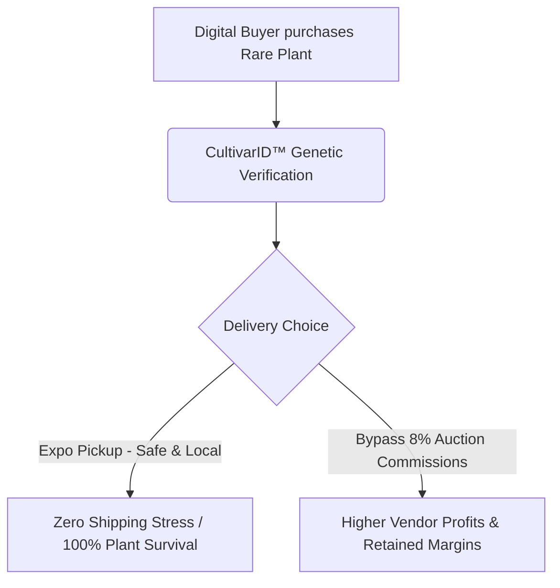

# 🌿 Rare Plant Vendors: Platform Value Proposition

The platform's architecture is systematically engineered to target, isolate, and neutralize the three primary friction points currently choking the high-ticket, luxury botanical niche. By aligning incentives across vendors, collectors, and the plants themselves, we unlock a frictionless transactional ecosystem.

---

## 🎯 The Three Core Friction Points

### 1. 🚜 For the Vendors

#### *Eradicating Commission Gouging & blind Logistics Risks*

* **Zero Commission Leakage:** We completely eliminate the punitive transaction commissions (often up to 8% or more) extracted by predatory live-auction platforms like **Whatnot** and **Palmstreet**. Vendors keep their hard-earned margins.
* **De-Risked Venue Logistics:** No more transporting fragile, high-value biological assets blindly to physical venues. We eliminate the extreme logistical overhead and physical damage risks of moving delicate inventory with no guaranteed buyer waiting on the other side.

> [!TIP]
> **Margin Protection:** Every dollar saved from live-auction commissions directly funds vendor growth and scale, allowing them to reinvest in premium tissue culture and cultivation.

---

### 2. 🛡️ For the Collectors

#### *Eliminating Fraud & Expo Floor Chaos*

* **Genetic Provenance Verified:** The proprietary **CultivarID™** system resolves the industry’s most critical vulnerability: the inability to verify genetic lineage, variegation stability, and mother-plant history. We shut down the rampant fraud associated with expensive, unverified cuttings.
* **Stress-Free Acquisition:** The pre-sale reservation mechanism entirely eliminates the frantic, highly stressful physical rush of the expo floor. Collectors secure their dream plants online and pick them up at their leisure.

> [!IMPORTANT]
> **CultivarID™ Trust Standard:** Every transaction backed by CultivarID™ establishes an immutable chain of custody, ensuring that collectors receive exactly the premium genetics they paid for.

---

### 3. 🌱 For the Biological Asset Itself

#### *Mitigating Extreme Weather & Shipping Trauma*

* **Zero-Shipping Hazards:** Shipping delicate, tropical flora overnight during sub-zero winters or scorching summers is an existential gamble. Our model keeps plants safe from temperature shock, delays, and box-throwing transit companies.
* **Acclimation Safety:** Plants transition smoothly from the breeder's controlled environment straight to the local expo hall, and finally to the buyer's home—with zero high-stress courier stops in between.

---

## ⚡ The Strategic Advantage: Localized Matchmaking

By pivoting to a highly optimized **localized matchmaking model**—connecting digital buyers to physical expo pickups—the platform elegantly solves the two biggest bottlenecks in the botanical industry:

* **🌿 100% Plant Survival Rate:** Bypassing shipping transit completely neutralizes thermal shocks and courier mortality rates.
* **💰 8% Commission Retention:** By avoiding digital-only auction channels, we capture lost revenue and return it directly to the local growers who power the market.
