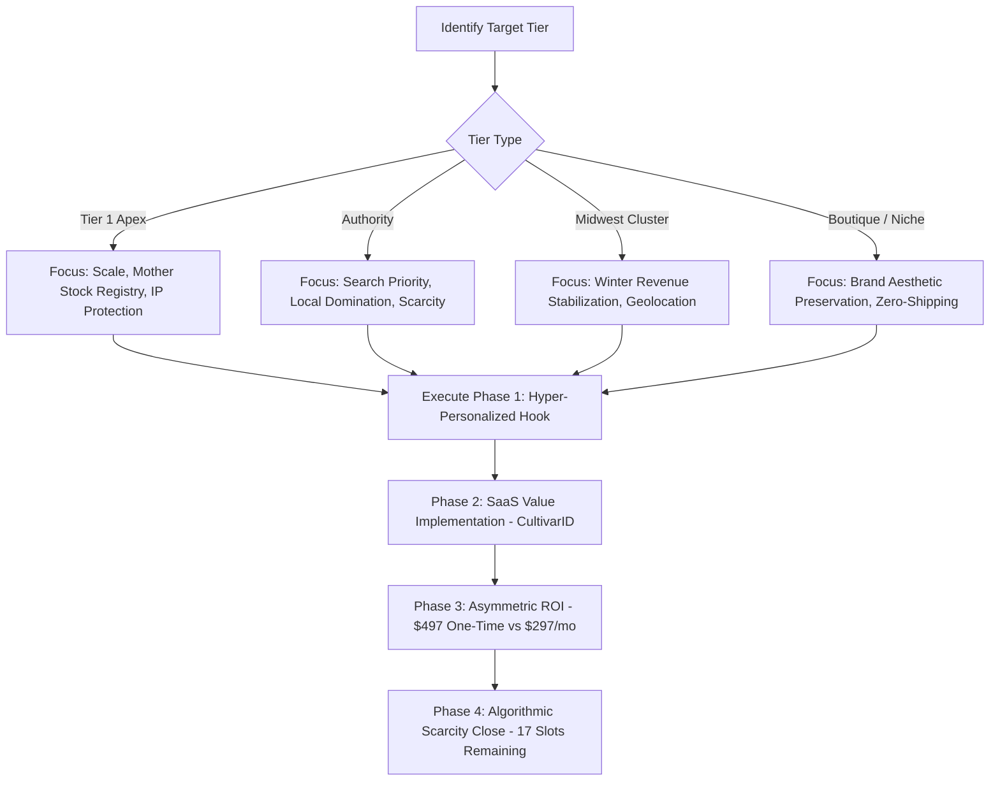

# Strategic Dossier and Conversion Framework for RarePlantVendors.com

This document serves as the operational playbook and data-dossier for the **RarePlantVendors.com Elite Founders Campaign**. It has been structured for programmatic consumption by AI agents, lead-enrichment tools, and automated outreach engines. 

---

## 1. Executive Briefing & Strategy Mechanics

### Macro-Market Context
The rare plant and horticultural market has transitioned from a fragmented hobbyist niche into a commercialized, multi-million-dollar industry characterized by high-stakes line breeding, tissue culture cloning, and intense collector demand. However, physical and administrative bottlenecks restrict growth:
1. **Shipping Trauma & Mortality:** Delicate tropical plants shipped via standard courier services face high mortality rates due to transit stress and cold-weather exposure.
2. **Provenance Deficit:** Proliferation of misidentified or counterfeit genetics (especially in high-value genera like *Hoya* and *Anthurium*) devalues authentic breeders.
3. **Regulatory Friction:** Over 83% of "rare plant" listings on generic marketplaces (e.g., Etsy) violate federal laws by shipping across state lines without mandated nursery licenses or phytosanitary certificates [5].

### The Technological Solution
1. **Geospatial Handovers:** Connecting verified local growers with regional collectors via geolocation. This bypasses the postal system entirely, eliminating cold-packaging expenses and transit shock.
2. **CultivarID Ledger:** An enterprise SaaS utility allowing breeders to assign unique alphanumeric IDs to distinct clones, log tissue-culture lineage, monitor environmental metrics (VPD, EC, pH), and transfer digital pedigree passports to buyers upon sale [3]. This creates a verifiable ecosystem of authenticity.

### Financial and Psychological Conversion Framework
- **Asymmetric ROI:** A single $497 capital expenditure replaces standard recurring SaaS operational costs of $297/month ($3,564/year). The payback period is 1.6 months.
- **Scarcity Dynamic:** Frame the "17 remaining slots" as an algorithmic hard-cap. Early adopters receive permanent search-priority placement on the local directory, capturing the highest volume of high-value regional traffic.

---

## 2. Master Prospect Database (35 Accounts)

This section maps all 35 target accounts. Each target is represented with a unified schema for programmatic parsing.

### [RPV-01] Agri-Starts, Inc.
- **Tier:** Tier 1 (Apex Producer)
- **Location:** Apopka, FL
- **Decision Maker:** Ty Strode (President & VP)
- **Contact Info:** (407) 884-5850 / tstrode@agristarts.com [6]
- **Core Specialty:** Tissue Culture, Starter Liners
- **Operational Pain Point:** Extreme complexity in tracking genetic lineage and mother stock across 210,000 sq. ft. of production and millions of culture jars [8].
- **CultivarID Solution:** Implements digital provenance passports for bulk culture batches, tracking clones from agar glass jar to retail nurseries [7].
- **Custom Outreach Script:**
  > "Ty, managing genetic stability across millions of tissue culture jars is a logistical beast. CultivarID provides a digital ledger to watermark your global tissue culture output. For a one-time $497 Elite Founder fee, you get a lifetime tracking infrastructure for mother stock, while our local directory routes retail traffic directly to the garden centers buying your liners, accelerating your reorder cycles."

### [RPV-02] Casa Flora, Inc.
- **Tier:** Tier 1 (Apex Producer)
- **Location:** Dallas, TX
- **Decision Maker:** Richard Lim (President)
- **Contact Info:** (972) 225-6111 / rlim@casaflora.com [10]
- **Core Specialty:** Wholesale Ferns, Specimen Breeding
- **Operational Pain Point:** Protecting intellectual property of proprietary genetics (e.g., 'Aubergine Lady' fern) and supporting downstream B2B retail buyers without competing with them [12].
- **CultivarID Solution:** Registers proprietary breeding genetics in the CultivarID database; digital passports transfer automatically to downstream buyers to verify authenticity [11].
- **Custom Outreach Script:**
  > "Richard, the breeding capital behind your 'Aubergine Lady' is immense. CultivarID secures your IP. When your downstream retailers sell your ferns, the end-consumer scans a CultivarID to verify authenticity back to your Dallas labs. For $497, you protect your wholesale brand while giving your retail partners a local marketing tool to capture foot traffic without shipping overhead."

### [RPV-03] Sol Soils
- **Tier:** Tier 1 (Soil Infrastructure)
- **Location:** Minneapolis, MN
- **Decision Maker:** Travis Thein (Founder & CEO)
- **Contact Info:** info@solsoils.com / (612) 424-3323 [14]
- **Core Specialty:** Premium Peat-Free Soil Amendments
- **Operational Pain Point:** Heavy, bulky packaging completely destroys DTC margins when shipping calcined clay and premium soil mixes across long distances [15].
- **CultivarID Solution:** Geolocation matching connects Sol Soils directly with local Twin Cities collectors and retail garden centers for bulk in-person fulfillment [16].
- **Custom Outreach Script:**
  > "Travis, as an ex-Target exec, you know heavy logistics kill DTC margins. Shipping premium potting mix drains your profit. Our local directory algorithmically pairs your Minneapolis warehouse with local plant collectors for direct local pickups. For a one-time $497, you eliminate freight shipping costs and permanently secure status as the exclusive substrate recommendation for all local transactions in the region."

### [RPV-04] Bonsai Bar
- **Tier:** Tier 1 (Event Retail)
- **Location:** Nationwide (HQ Boston, MA)
- **Decision Maker:** Tim Arsenault (Founder & CEO)
- **Contact Info:** (617) 545-7790 / tim@bonsaibar.com [18]
- **Core Specialty:** Experiential Event-Based Bonsai Retail
- **Operational Pain Point:** High post-event tree mortality triggers liability under their "Tree Guarantee" [18]; lacks a post-class CRM to track care and upsell kits.
- **CultivarID Solution:** Attendees register their newly potted trees in the CultivarID app, enabling Bonsai Bar to push care/pruning logs and reduce replacement costs.
- **Custom Outreach Script:**
  > "Tim, tracking the survival rate of the 100,000+ trees you've deployed at brewery workshops is impossible without local care CRM. CultivarID lets attendees log their trees post-event. You push pruning schedules and watering logs directly to their phones, drastically cutting your 'Tree Guarantee' replacement costs while retaining users for secondary DIY upsells."

### [RPV-05] Ecuagenera
- **Tier:** Tier 1 (Global Importer)
- **Location:** Ecuador / Apopka, FL
- **Decision Maker:** Jose Portilla (Founder & CEO)
- **Contact Info:** sales@ecuagenera.com / (407) 880-1999 [22]
- **Core Specialty:** Exotic Orchids & Rare Aroids
- **Operational Pain Point:** Extremely high mortality rates when imported tropical specimens undergo secondary packaging and domestic shipping after clearing customs.
- **CultivarID Solution:** Geolocalized pop-up and hub matching enables imported plants to be picked up directly by regional buyers immediately after clearing customs.
- **Custom Outreach Script:**
  > "Jose, the domestic shipping stress placed on an Anthurium immediately after it clears CITES and customs in Florida is devastating your import margins. RarePlantVendors lets you geo-target regional buyers to coordinate direct local pickups. For a one-time $497, you bypass domestic postal networks, delivering acclimated imports directly into collector hands."

### [RPV-06] Bredren Orchids
- **Tier:** Tier 1 (Boutique Breeder)
- **Location:** Central Florida
- **Decision Maker:** Phillip Hamilton (Owner & Founder)
- **Contact Info:** (407) 592-1234 / bredrenorchids@gmail.com [23]
- **Core Specialty:** Novelty Phalaenopsis & Broughtonia Hybrids
- **Operational Pain Point:** Lacks digital hybrid pedigree databases for elite AOS judging standards; show blooms are highly susceptible to shipping damage [24].
- **CultivarID Solution:** Implements digital hybrid registry to track multiple generations of parentage, providing immutable digital lineage certificates for buyers.
- **Custom Outreach Script:**
  > "Phillip, as an AOS Senior Judge, your hybrid pedigree records are your business's crown jewels. CultivarID digitizes your Broughtonia lineages. When you sell a collector-grade hybrid, you transfer the digital pedigree passport to the buyer, proving genetic authenticity. For $497, you secure lifetime registry rights and ensure delicate blooms are hand-exchanged."

### [RPV-07] Pelican Coast Farms / Orchids Amore
- **Tier:** Tier 1 (Boutique Breeder)
- **Location:** Southwest Florida
- **Decision Maker:** Jerry Meola (Owner)
- **Contact Info:** (239) 731-1974 / jerry@orchidsamore.com [26]
- **Core Specialty:** Collector Cattleyas & Orchid Photography
- **Operational Pain Point:** Shipping blooming-size *Cattleyas* causes ethylene gas build-up, destroying award-winning flowers in transit [27].
- **CultivarID Solution:** Integrates Jerry's high-resolution photographic catalog into the CultivarID visual phenotype registry for local target sales.
- **Custom Outreach Script:**
  > "Jerry, shipping a blooming Cattleya in a dark box ruins the flowers before they arrive. CultivarID lets you pair your extensive high-res photography catalog with a hyper-local buyer network. They browse the visuals and pick up the blooming specimens in person. For a one-time $497, you eliminate mail transit risks and secure permanent local search dominance."

### [RPV-08] LA Orchid Connection
- **Tier:** Tier 1 (Show Specialist)
- **Location:** Baton Rouge, LA
- **Decision Maker:** John Nelson (Owner)
- **Contact Info:** laorchidconnection@gmail.com / (225) 244-1233 [29]
- **Core Specialty:** Specimen Orchids, Event Pre-Orders
- **Operational Pain Point:** Handling manual, fragmented e-commerce pre-orders and inventory reservation sheets for regional orchid expos [31].
- **CultivarID Solution:** Automated show pre-order storefront matching local buyers to specific pickup events, ensuring reservation logistics are streamlined.
- **Custom Outreach Script:**
  > "John, you already know local pickups make show pre-orders profitable. Our app automates that entire sheet-based system. Local Louisiana collectors browse your verified CultivarID catalog and secure purchases before show day. The $497 lifetime access streamlines your expo logistics and bypasses standard custom web-build costs."

### [RPV-09] Florida Star Nurseries / Secret Garden Rare Plants
- **Tier:** Tier 1 (Niche Elite)
- **Location:** Marianna, FL
- **Decision Maker:** Jodie L. Shumaker (Owner)
- **Contact Info:** (850) 482-1200 / secretgardenplants@gmail.com [34]
- **Core Specialty:** Ultra-Rare Hoya Cultivars
- **Operational Pain Point:** Mass scale online genetic dilution and counterfeiting (e.g. fake 'Argentea Princess') by unlicensed Etsy operators [36].
- **CultivarID Solution:** Lock down intellectual property by registering original clone lineages ('Nova Ghost', 'compacta') with immutable alphanumeric tracking codes.
- **Custom Outreach Script:**
  > "Jodie, online scammers are diluting your legacy by selling counterfeit 'Argentea Princess' cuttings. CultivarID is your digital lock. You register the true, verified lineage of your mother clones on our ledger. For $497, you protect your life's breeding work from fraud, and ensure delicate tropical Hoyas never freeze in winter transit."

### [RPV-10] Carnivero
- **Tier:** Authority (Regional Heavyweight)
- **Location:** Austin, TX
- **Decision Maker:** Drew Martinez (Founder)
- **Contact Info:** (512) 677-7448 / info@carnivero.com [37]
- **Core Specialty:** Carnivorous Plants (Nepenthes) & Rare Aroids
- **Operational Pain Point:** Bidders in their high-value "Rare Plant Vault" auctions demand extreme proof of genotypic lineage to prevent poaching/counterfeiting [39].
- **CultivarID Solution:** Embed CultivarID digital tracking into all high-value specimen vault listings as an official digital certificate of authenticity.
- **Custom Outreach Script:**
  > "Drew, high-ticket bidders in your Rare Plant Vault need absolute certainty that their 8th-gen Nepenthes clone is genetically verified. CultivarID acts as the ultimate authentication protocol for your premium auctions. A one-time $497 secures your lifetime SaaS tier, protecting your IP while matching Austin collectors directly for local greenhouse handoffs."

### [RPV-11] One More House Plant
- **Tier:** Authority (Regional Heavyweight)
- **Location:** Indiana
- **Decision Maker:** Lead Outreach Manager
- **Contact Info:** info@onemorehouseplant.com
- **Core Specialty:** Rare Monstera & Philodendron Varieties
- **Operational Pain Point:** High social media following (Instagram) fails to convert to local revenue due to high shipping risk and packaging costs.
- **CultivarID Solution:** Geolocation directory aggregates and geolocates their Midwestern followers to convert digital reach into local, zero-shipping pickups.
- **Custom Outreach Script:**
  > "Your IG following is incredible, but packaging high-value monsteras for mail delivery is a constant gamble. Our platform geolocates your regional Midwestern followers, driving secure, local in-person sales that completely bypass shipping and boxing costs. Your $497 lifetime subscription turns your local social reach into a pure margin engine."

### [RPV-12] Pat's Southern Roots
- **Tier:** Authority (Regional Heavyweight)
- **Location:** Florida
- **Decision Maker:** Lead Outreach Manager
- **Contact Info:** (850) 443-4416 / patssouthernroots@gmail.com
- **Core Specialty:** Acclimated Florida Exotic Tropicals
- **Operational Pain Point:** Deep market saturation in Florida requires high ad-spend to maintain local search prominence and client acquisition.
- **CultivarID Solution:** Lifetime search priority placement on the local directory to capture maximum regional traffic in their target zip codes.
- **Custom Outreach Script:**
  > "The Florida nursery market is heavily crowded. CultivarID ensures you stand out. The $497 Elite Founders tier grants you permanent, algorithm-backed priority search placement in local zip codes. When regional collectors open the app, your verified direct-from-nursery tropicals appear first."

### [RPV-13] MorphMarket
- **Tier:** Authority (Enterprise Platform)
- **Location:** Nationwide
- **Decision Maker:** Strategic Partnerships Director
- **Contact Info:** support@morphmarket.com
- **Core Specialty:** Multi-vendor Rare Plant & Reptile Market
- **Operational Pain Point:** Quality control and verifying legitimacy of independent plant sellers to eliminate counterfeit botanical listings.
- **CultivarID Solution:** B2B API integration of CultivarID verification to validate seller licensing and crop provenance at scale.
- **Custom Outreach Script:**
  > "To safely scale plant listings on your marketplace, verifying seller nursery licenses is key. CultivarID provides an API layer to authenticate crop provenance and seller licenses instantly. Securing an Elite Founders integration license for $497 gives your dev team the sandbox keys to safeguard transactions and devalue unverified sellers."

### [RPV-14] Redland Nursery
- **Tier:** Seedling (Global/Local Connector)
- **Location:** Homestead, FL
- **Decision Maker:** Operations Director
- **Contact Info:** (305) 248-5109 / redlandnursery@gmail.com
- **Core Specialty:** Large Landscape Specimens & Exotic Canopy
- **Operational Pain Point:** Physically impossible or cost-prohibitive to ship 10-foot tall tropical and palm specimens via standard shipping methods.
- **CultivarID Solution:** Local matching maps large-scale specimens exclusively to regional buyers with flatbeds/trucks for physical site pick-up.
- **Custom Outreach Script:**
  > "You can't box and ship a 10-foot canopy specimen via FedEx. CultivarID matches your large-scale landscape inventory strictly with regional Florida buyers and landscape contractors ready for direct physical pickup. A one-time $497 eliminates standard monthly listing overhead while driving local high-ticket sales."

### [RPV-15] EFG Orchids
- **Tier:** Seedling (Global/Local Connector)
- **Location:** DeLand, FL
- **Decision Maker:** George Hausermann (Owner)
- **Contact Info:** (386) 738-8600 / info@efgorchids.com [29]
- **Core Specialty:** Heritage Collector Orchids & Tropicals
- **Operational Pain Point:** Risk of losing historical, decades-old hybrid breeding histories and legacy documentation of rare orchid lines.
- **CultivarID Solution:** Immutable pedigree logs to digitally preserve historical botanical hybrids and legacy stock lineage.
- **Custom Outreach Script:**
  > "George, EFG represents decades of legendary orchid hybrid breeding. CultivarID acts as your digital vault to preserve those heritage lineage records permanently. For $497, you secure a lifetime SaaS registry to catalog your historical crosses, protecting the EFG legacy and routing Florida orchid collectors straight to your greenhouse doors."

### [RPV-16] Thai Exotic Greenery
- **Tier:** Seedling (Importer)
- **Location:** Thailand / US
- **Decision Maker:** Import Logistics Coordinator
- **Contact Info:** info@thaiexoticgreenery.com
- **Core Specialty:** Direct-from-Source Rare Aroid Importation
- **Operational Pain Point:** Imported specimens suffer massive mortality rates if packaged for secondary domestic mail transit immediately post-customs.
- **CultivarID Solution:** Pre-sells incoming import batches for local hand-off immediately upon USDA inspection clearance, saving shipping trauma.
- **Custom Outreach Script:**
  > "Imported plants are incredibly fragile right after clearing phytosanitary inspection. CultivarID lets you pre-sell import batches to regional buyers who collect them in person the moment they clear customs. Bypassing the second domestic shipping leg preserves your valuable import margins for a one-time $497 fee."

### [RPV-17] House of Plants TH
- **Tier:** Seedling (Importer)
- **Location:** Thailand / US
- **Decision Maker:** Wholesale Operations Manager
- **Contact Info:** info@houseofplantsthailand.com
- **Core Specialty:** High-Value Variegated Monstera Imports
- **Operational Pain Point:** Root rot and shipping shock on imported high-end specimens when subjected to multi-day domestic shipping box setups.
- **CultivarID Solution:** Geographically targets local pickup collectors for instant, local in-person handovers of highly fragile imported specimens.
- **Custom Outreach Script:**
  > "variegated imports are highly sensitive to shipping rot. Our geolocation network links your US customs arrival hubs with collectors who pick up directly in person, keeping import shock to zero. A single $497 Elite Founder subscription secures your lifetime access, protecting thousands of dollars in delicate leaf inventory."

### [RPV-18] Scindapsus Borneo
- **Tier:** Seedling (Niche Specialist)
- **Location:** Global / Niche
- **Decision Maker:** Species Registry Coordinator
- **Contact Info:** info@scindapsusborneo.com
- **Core Specialty:** Ultra-Rare Wild Scindapsus Species
- **Operational Pain Point:** Unscrupulous sellers passing off common Scindapsus cultivars as highly expensive, newly discovered wild Borneo species.
- **CultivarID Solution:** Implements a strict wild genetic registry with micro-timeline photos to guarantee species authenticity.
- **Custom Outreach Script:**
  > "Scammers are copying your rare Scindapsus imports and selling fakes. CultivarID gives you an immutable registry to tag your true wild Borneo parent plants. By transferring genetic passports with every cutting, you verify authenticity and isolate scammers. Protect your niche leadership with a lifetime $497 plan."

### [RPV-19] Graye’s Greenhouse
- **Tier:** Midwest Cluster (Weather Vulnerable)
- **Location:** Plymouth, MI
- **Decision Maker:** Operations Director
- **Contact Info:** (734) 453-1220 / grayesgreenhouse@gmail.com
- **Core Specialty:** Succulents & Hard-to-Find Tropicals
- **Operational Pain Point:** Midwest winters (November - April) freeze e-commerce shipping operations completely, cutting annual sales volume in half.
- **CultivarID Solution:** Direct hyper-local secure winter pickup routing to drive localized foot traffic to the greenhouse during freeze months.
- **Custom Outreach Script:**
  > "Michigan winters choke off plant shipping for six straight months. CultivarID stabilizes your winter revenue by geolocating Plymouth and Detroit area collectors for safe, in-person pickups at your greenhouse. Bypassing FedEx during freeze months secures your margins. Your $497 lifetime subscription pays for itself with the first saved winter batch."

### [RPV-20] Telly's Greenhouse
- **Tier:** Midwest Cluster (Weather Vulnerable)
- **Location:** Troy, MI
- **Decision Maker:** Rare Specimen Buyer
- **Contact Info:** (248) 689-8735 / tellysgreenhouse@gmail.com
- **Core Specialty:** Rare Indoor Houseplants, Specimen Bonsai
- **Operational Pain Point:** Hard to manage and track individual developmental records and soil profiles for premium high-end bonsai specimens.
- **CultivarID Solution:** Digital environmental and care journaling logs tailored to premium bonsai development histories [3].
- **Custom Outreach Script:**
  > "Your specimen Bonsais require intense care documentation. CultivarID offers your team a digital tracking journal to log pruning, electrical conductivity (EC), and soil amendments. Local search optimization routes Detroit collectors to you in person, avoiding shipping stress on old trees. Secure a lifetime tracking vault for a $497 payment."

### [RPV-21] Goldner Walsh
- **Tier:** Midwest Cluster (Weather Vulnerable)
- **Location:** Pontiac, MI
- **Decision Maker:** Events & Retail Director
- **Contact Info:** (248) 332-6430 / info@goldnerwalsh.com
- **Core Specialty:** Premium Indoor Plants, Event Venue
- **Operational Pain Point:** Generating consistent foot-traffic and retail nursery visitors to justify their large venue overhead.
- **CultivarID Solution:** Priority location directory matching matches local botanical buyers with physical store visits to view aroids.
- **Custom Outreach Script:**
  > "You have an incredible physical greenhouse venue, but getting targeted collectors through the door in Pontiac is a constant grind. CultivarID geo-matches local rare plant buyers in real-time, directing them to goldner Walsh for local pickup and driving premium foot traffic. Make a one-time $497 investment to command regional search priority forever."

### [RPV-22] Arrowhead Alpines
- **Tier:** Midwest Cluster (Weather Vulnerable)
- **Location:** Fowlerville, MI
- **Decision Maker:** Horticulturalist Manager
- **Contact Info:** (517) 223-3581 / arrowheadalpines@gmail.com
- **Core Specialty:** Rare Alpine Perennials & Native Species
- **Operational Pain Point:** Perennial collectors shipping plants outside of their proper hardiness/ecological zones, resulting in plant failure.
- **CultivarID Solution:** Enforces geographical/hardiness limit checking on the platform directory, keeping native cultivars local.
- **Custom Outreach Script:**
  > "Shipping delicate alpines outside of their natural zone leads to plant deaths and customer refunds. CultivarID maps your unique stock strictly to local and regional gardeners who match your hardiness parameters, protecting ecological integrity. Bypass recurring software fees with a lifetime $497 tier."

### [RPV-23] The Plant House
- **Tier:** Midwest Cluster (Weather Vulnerable)
- **Location:** Ferndale, MI
- **Decision Maker:** Retail Shop Owner
- **Contact Info:** planthouseferndale@gmail.com
- **Core Specialty:** Trendy Houseplants & Collector Aroids
- **Operational Pain Point:** High competition from online big-box retailers; needs local digital visibility in the trendy Ferndale/Detroit market.
- **CultivarID Solution:** Elite Founders search priority permanently ranks their store at the top of local Ferndale search queries.
- **Custom Outreach Script:**
  > "Standing out in Ferndale's boutique scene is all about local visibility. CultivarID secures your store permanent priority search placement in local zip codes. When local collectors search for rare plants, your shop appears first. Lock in your local unfair advantage with a one-time $497 Elite Founders slot."

### [RPV-24] Wildtype Native Plant
- **Tier:** Midwest Cluster (Weather Vulnerable)
- **Location:** Mason, MI
- **Decision Maker:** Restoration Specialist
- **Contact Info:** (517) 244-1140 / wildtype@nativeplants.com
- **Core Specialty:** Ecotype Native Trees, Shrubs & Plugs
- **Operational Pain Point:** Ensuring local restoration clients receive site-specific ecotypes rather than generic mass-produced species.
- **CultivarID Solution:** Uses CultivarID registry to map and tag seed sources to specific geo-coordinates, validating ecological authenticity.
- **Custom Outreach Script:**
  > "Native restoration relies on precise seed source ecotypes. CultivarID lets you tag your mother stock with geographic coordinates, verifying true local provenance for ecological buyers. A $497 lifetime registration provides a robust database to track native seed progeny, bypassing standard database costs."

### [RPV-25] Big Shoulders Nursery
- **Tier:** Midwest Cluster (Weather Vulnerable)
- **Location:** Chicago, IL
- **Decision Maker:** Lead Aroid Breeder
- **Contact Info:** info@bigshouldersnursery.com
- **Core Specialty:** Premium Collector Aroids (*Anthurium* & *Philodendron*)
- **Operational Pain Point:** Extreme Chicago winters shut down parcel shipping for high-value tropicals completely, causing zero cash-flow months.
- **CultivarID Solution:** Local safe transaction and hand-off matching maps their rare tropical inventory directly to active Chicago collectors.
- **Custom Outreach Script:**
  > "Chicago winters choke off standard shipping for high-end tropical aroids completely. CultivarID keeps your revenue stable by geolocating local Chicago collectors for secure, temperature-safe in-person handoffs. Secure winter cash flow and avoid dead-on-arrival refunds. Your $497 Elite Founder license replaces all future SaaS overhead."

### [RPV-26] Dandi Plants
- **Tier:** Midwest Cluster (Weather Vulnerable)
- **Location:** Michigan
- **Decision Maker:** Boutique Lead
- **Contact Info:** (734) 237-7008 / dandiplants@gmail.com
- **Core Specialty:** Curated Collector Tropical Foliage
- **Operational Pain Point:** Under-priced, unlicensed Etsy and Facebook sellers diluting the margins of legitimate brick-and-mortar boutique nurseries.
- **CultivarID Solution:** Verified license badge and CultivarID validation codes instantly justify premium, authentic pricing structures.
- **Custom Outreach Script:**
  > "Competing with unlicensed backyard sellers on Etsy drains your margin. CultivarID displays your state nursery license verified status prominently. By attaching a digital provenance log to your rare tropicals, you prove your value. Secure a lifetime verified status for $497, separating your shop from the amateurs."

### [RPV-27] Chicago Plant Babe
- **Tier:** Midwest Cluster (Weather Vulnerable)
- **Location:** Chicago, IL
- **Decision Maker:** Lead Influencer/Owner
- **Contact Info:** chicagoplantbabe@gmail.com
- **Core Specialty:** Rare Variegated Aroids, Social Media Sales
- **Operational Pain Point:** High digital audience local concentration in Chicago, but lacks a secure local transactional framework to run safe meetups.
- **CultivarID Solution:** Geolocation mapping platform serves as a secure transaction portal to safely monetize local Instagram followers.
- **Custom Outreach Script:**
  > "You have a massive Chicago social following, but shipping tropicals to them in winter is a nightmare. Our app acts as your local transaction broker. Your Chicago followers purchase securely in-app and pick up at a designated safe zone, protecting your margins. Secure lifetime transaction capabilities for $497."

### [RPV-28] Sunnyside Plants
- **Tier:** Midwest Cluster (Weather Vulnerable)
- **Location:** Chicago, IL
- **Decision Maker:** Retail Manager
- **Contact Info:** (773) 853-2700 / sunnysideplantschicago@gmail.com
- **Core Specialty:** Urban Houseplants & Collector Varieties
- **Operational Pain Point:** Severe neighborhood retail competition from boutique plant shops in Chicago's dense North Side.
- **CultivarID Solution:** Geolocation targets hyper-local neighborhood zip codes, directing foot traffic to their physical storefront.
- **Custom Outreach Script:**
  > "Capturing neighborhood foot traffic in Chicago's competitive market is everything. CultivarID geo-targets urban plant buyers right in your zip code, driving them straight to your storefront for local pickup. A one-time $497 subscription permanently ranks your inventory first for neighborhood searches."

### [RPV-29] Detroit Wildflower
- **Tier:** Midwest Cluster (Weather Vulnerable)
- **Location:** Detroit, MI
- **Decision Maker:** Urban Native Lead
- **Contact Info:** (313) 473-0400 / detroitwildflower@gmail.com
- **Core Specialty:** Urban Native Wildflowers & Pollinators
- **Operational Pain Point:** Hard to connect local urban growers and green space developers directly with Detroit-propagated native genetics.
- **CultivarID Solution:** Maps Detriot-grown wildflowers directly to urban redevelopment, community gardens, and restoration projects.
- **Custom Outreach Script:**
  > "Native urban restoration works best with highly local genetics. CultivarID connects your Detroit-grown wildflower inventory directly with city-based community gardens and urban developers in real-time. For a single $497 fee, you acquire a permanent, local sales channel and skip monthly listing fees."

### [RPV-30] Lost in the Forrest
- **Tier:** Midwest Cluster (Weather Vulnerable)
- **Location:** Minnesota
- **Decision Maker:** Operations Director
- **Contact Info:** (952) 405-6415 / info@lostintheforrest.com
- **Core Specialty:** High-End Collector Tropicals & Hard-to-Find Foliage
- **Operational Pain Point:** Extreme Minnesota winters (sub-zero temperatures) halt e-commerce and mail orders completely, causing massive seasonal overhead.
- **CultivarID Solution:** Integrates a secure local collection portal to coordinate safe customer handovers at their physical shop.
- **Custom Outreach Script:**
  > "Minnesota winter freezes e-commerce shipping. Our geolocation platform keeps your sales running by matching local Twin Cities collectors for secure, in-person pickups right at your retail storefront. Avoid cold-transit losses. Your $497 Elite Founders slot eliminates standard monthly SaaS billing permanently."

### [RPV-31] The Botanical Bar
- **Tier:** Midwest Cluster (Weather Vulnerable)
- **Location:** Indianapolis, IN
- **Decision Maker:** Lead Buyer/Owner
- **Contact Info:** hello@thebotanicalbarindy.com
- **Core Specialty:** Curated Boutique Houseplants & Designer Pots
- **Operational Pain Point:** High delivery expense and transit damage to premium collector foliage sold to local Indianapolis buyers.
- **CultivarID Solution:** Local secure matching coordinates direct, damage-free handovers of pristine interior plant selections.
- **Custom Outreach Script:**
  > "Delivering designer plants in Indy without damage is costly. Our platform maps your high-end inventory straight to local Indianapolis collectors for direct, damage-free local handovers. Keep your plant presentation perfect. Make a one-time $497 investment to secure lifetime local directory priority."

### [RPV-32] Leafy Soulmates
- **Tier:** Boutique (Designer Niche)
- **Location:** Southern California
- **Decision Maker:** Design Operations Director
- **Contact Info:** (714) 933-6021 / leafysoulmates@gmail.com
- **Core Specialty:** High-Aesthetic Rare Tropical Aroids
- **Operational Pain Point:** Standard shipping box transit damage completely ruins the premium, visually perfect brand aesthetic.
- **CultivarID Solution:** In-person geolocation matching ensures foliage is handed directly to the collector in pristine, unboxed condition.
- **Custom Outreach Script:**
  > "A single crushed leaf in a shipping box ruins your premium brand aesthetic. CultivarID matches your high-aesthetic tropicals directly with local SoCal collectors for direct handovers, keeping your plants picture-perfect. Lock in lifetime priority directory search for a $497 capitalization."

### [RPV-33] Hortikult
- **Tier:** Boutique (Designer Niche)
- **Location:** Designer Aroid Focus
- **Decision Maker:** Lead Designer
- **Contact Info:** info@hortikult.com
- **Core Specialty:** Curated Collector Aroids & Plant Design
- **Operational Pain Point:** Discerning high-net-worth collectors demand high-resolution developmental journals and proof of lineage.
- **CultivarID Solution:** CultivarID's high-tech digital timeline and photo galleries serve as the ultimate digital certificate of authenticity [3].
- **Custom Outreach Script:**
  > "Your designer clients expect perfection. CultivarID acts as a digital seal of authenticity. Every premium aroid gets an interactive timeline showing its growth and genetic lineage, which you transfer to the collector. For a one-time $497, you secure a digital luxury experience that commands premium prices."

### [RPV-34] ileafU
- **Tier:** Boutique (Designer Niche)
- **Location:** Modern Branding
- **Decision Maker:** Creative Director
- **Contact Info:** hello@ileafu.com
- **Core Specialty:** High-End Curated Plants & Modern Plant Art
- **Operational Pain Point:** Standard cardboard shipping containers clash with their hyper-modern, clean brand and visual aesthetics.
- **CultivarID Solution:** In-person localized transaction networks and interactive digital passports elevate their modern visual branding.
- **Custom Outreach Script:**
  > "Cardboard shipping boxes ruin the presentation of your modern plant art. CultivarID bypasses mail carrier transit, geolocating local design-forward collectors for direct handovers. The $497 lifetime subscription eliminates operational SaaS fees, letting you present your creations flawlessly."

### [RPV-35] PhilodenDream
- **Tier:** Boutique (Designer Niche)
- **Location:** High-End Collector Focus
- **Decision Maker:** Yulia Alexan (Owner)
- **Contact Info:** yulia.alexan@gmail.com
- **Core Specialty:** Premium Collector Philodendrons & Variegated Cultivars
- **Operational Pain Point:** Extreme demand for high-variegation parentage verification and clone history from elite, high-ticket plant collectors.
- **CultivarID Solution:** Provides comprehensive high-resolution visual growth journals to justify premium valuations for highly variegated clones [3].
- **Custom Outreach Script:**
  > "Elite collectors demand proof of parentage before spending top dollar on variegated Philodendrons. CultivarID creates a visual timeline of your clones, proving genetic stability over time. For $497, you acquire a premium ledger to secure your valuations, while our local routing avoids shipping stress."

---

## 3. Secondary/Alternative Outreach Targets

These profiles represent supplementary leads for campaign expansion.

| Target Name | Core Competency | Primary Contact | Notes & Strategic Vector |
| :--- | :--- | :--- | :--- |
| **Maneki Hill Orchids** | Rare Specimen Orchids | @manekihill (Instagram) | High-end specimen focus. Bypasses shipping damage on delicate blooms. |
| **Midnight Garden** | Collector Rare Aroids | @midnightgarden (Instagram) | Fits "Dark Forest Luxe" aesthetic. CultivarID justifies visual authenticity. |
| **Plant Moron** | Niche Plant Accessories | @plantmoron (Instagram) | Perfect for accessory cross-selling to the regional directory database. |
| **PlantHaul** | Specialized Plant Logistics | @planthaul (Instagram) | Potential regional partner to coordinate local bulk distribution hubs. |
| **Moonmere** | Boutique Specimen Plants | @moonmere (Instagram) | High collector focus; ideal for CultivarID lineage tracking. |
| **Lumos Candle Co** | Botanical Gift Products | @lumoscandleco (Instagram) | Ideal target for regional green expo gift sections and cross-marketing. |

---

## 4. B2B Sales Execution Framework

This structured logic guides the outreach pipeline.

### Detailed Outreach Execution Pipeline

#### Phase 1: The Hyper-Personalized Hook
Initiate contact by establishing immediate botanical authority. Never use generic greetings. Reference specific breeding lines, locations, or environmental challenges.
* *Example (Jodie Shumaker):* "Jodie, the survival of your 'Argentea Princess' genetics through the hurricane is botanical legend, but online scammers are copying your clones on Etsy. I'm reaching out because we've built a digital infrastructure to permanently lock down your genetic IP."

#### Phase 2: SaaS Value Implementation
Present the dual-value mechanical solution of the platform:
1. **Geolocation Routing:** Connects local buyers directly, removing cold-packaging overhead and courier delays.
2. **CultivarID Ledger:** An immutable tracking system for crop/clone lineages, modeling databases like the Tropical Crop Omics Database [1] to verify genotypic and phenotypic provenance.

#### Phase 3: The Asymmetric ROI Proposition
Frame the $497 pricing model as a rare capital investment opportunity rather than a recurring cost:
* *Script:* "Standard access to our local matching and CultivarID ledger is $297/month. Over a year, that's over $3,500. We're letting a highly curated selection of foundational growers bypass the subscription model entirely with a one-time capital investment of $497 for life. It pays for itself the moment it saves a single collector-grade plant from freezing in the mail."

#### Phase 4: Algorithmic Scarcity Close
Enforce urgency by framing the 17 remaining slots as an infrastructure necessity:
* *Script:* "We have hard-capped this Elite Founders tier to 17 remaining slots. This is an algorithmic restriction. We are coding the directory to permanently prioritize Elite Founders in regional search results. If we dilute this tier, that search priority loses its value. Once these 17 slots are taken, the lifetime buyout closes forever, and competitors will be forced onto the $297/month plan."

---

## 5. Strategic Moats & Deep Dives

### Overcoming Interstate Transport and Regulatory Friction
The rare plant market is saturated with unlicensed, high-risk home growers. Research shows that over **83% of "rare plant" listings** on generic retail marketplaces (e.g., Etsy) lack nursery licenses and violate USDA/state regulations for interstate movement of regulated plants [5]. 
- **The RPV Moat:** RarePlantVendors.com enforces nursery license verification for all sellers. Furthermore, the geolocation-based matching restricts transactions to intra-state, local handovers. This completely bypasses USDA interstate phytosanitary certificate mandates and interstate transport laws, dramatically reducing legal friction for vendors.

### Mitigating Genetic Swamping and Conservation
For conservation-focused nurseries (e.g., Carnivero [39], Wildtype Native Plant), maintaining genetic purity is vital. Uncontrolled hybridization poses severe swamping risks to native species [41]. 
- **The CultivarID Moat:** CultivarID's immutable database registry tracks pure wild-source coordinates and lineages, separating pure-species genetics from common hybrid varieties. This elevates the seller's authority from a standard nursery to a certified ecological conservation partner.

---

## Works Cited

1. *TCOD: an integrated resource for tropical crops* | Nucleic Acids Research - Oxford Academic, accessed May 31, 2026, [https://academic.oup.com/nar/article/52/D1/D1651/7318109](https://academic.oup.com/nar/article/52/D1/D1651/7318109)  
2. *The Dataset of Camellia Cultivars Names in the World* - ResearchGate, accessed May 31, 2026, [https://www.researchgate.net/publication/348612474_The_Dataset_of_Camellia_Cultivars_Names_in_the_World](https://www.researchgate.net/publication/348612474_The_Dataset_of_Camellia_Cultivars_Names_in_the_World)  
3. *Grower's Journal – Apps on Google Play*, accessed May 31, 2026, [https://play.google.com/store/apps/details?id=com.growersjournal.main&hl=en_NZ](https://play.google.com/store/apps/details?id=com.growersjournal.main&hl=en_NZ)  
4. *company_contact_list.csv* / *First half outreach.csv*  
5. *Best Places to Buy Plants Online: Trusted Nurseries & What to Avoid* - LifeTips, accessed May 31, 2026, [https://lifetips.alibaba.com/plant-care/best-places-to-buy-plants-online](https://lifetips.alibaba.com/plant-care/best-places-to-buy-plants-online)  
6. *Agri-Starts, Inc. - This Farm CARES*, accessed May 31, 2026, [https://www.thisfarmcares.org/agristarts-inc](https://www.thisfarmcares.org/agristarts-inc)  
7. *The Inside Scoop of What Keeps Agri-Starts Growing* - Greenhouse Grower, accessed May 31, 2026, [https://www.greenhousegrower.com/crops/the-inside-scoop-of-what-keeps-agri-starts-growing/](https://www.greenhousegrower.com/crops/the-inside-scoop-of-what-keeps-agri-starts-growing/)  
8. *Fresh Take on Specialty Crops and Tech Keep Agri-Starts Growing*, accessed May 31, 2026, [https://www.growingproduce.com/fruits/new-specialty-crops-and-technology-keep-agri-starts-growing/](https://www.growingproduce.com/fruits/new-specialty-crops-and-technology-keep-agri-starts-growing/)  
9. *Meet Ty Strode of Agri-Starts, Inc. in Apopka* - Farm Flavor, accessed May 31, 2026, [https://farmflavor.com/florida/meet-ty-strode-agri-starts-inc-apopka-florida/](https://farmflavor.com/florida/meet-ty-strode-agri-starts-inc-apopka-florida/)  
10. *Casa Flora - Showcase Texas*, accessed May 31, 2026, [https://www.showcasetexas.org/store/m/1610-Casa-Flora.aspx](https://www.showcasetexas.org/store/m/1610-Casa-Flora.aspx)  
11. *Southern Hospitality* - GrowerTalks, accessed May 31, 2026, [https://www.growertalks.com/Article/?articleid=18279](https://www.growertalks.com/Article/?articleid=18279)  
12. *Plants from Cultivate; Jim Nau Memories; Educating Educators* - GrowerTalks, accessed May 31, 2026, [https://www.growertalks.com/Newsletters/View/Newsletter/?article=4271](https://www.growertalks.com/Newsletters/View/Newsletter/?article=4271)  
13. *GO TEXAN WHOLESALE NURSERIES*, accessed May 31, 2026, [http://www.gotexan.org/LinkClick.aspx?fileticket=nCnDJwZmU1w=&tabid](http://www.gotexan.org/LinkClick.aspx?fileticket=nCnDJwZmU1w%3D&tabid)  
14. *Mossify*, accessed May 31, 2026, [https://www.mossify.ca/](https://www.mossify.ca/)  
15. *Sol Soils 2 Quart Fast-Draining Succulent Potting Mix* - Organic Peat Moss Free Soil Blend, accessed May 31, 2026, [https://www.lowes.com/pd/Sol-Soils-2-Quart-Fast-Draining-Succulent-Potting-Mix-Organic-Peat-Moss-Free-Soil-Blend/8041168](https://www.lowes.com/pd/Sol-Soils-2-Quart-Fast-Draining-Succulent-Potting-Mix-Organic-Peat-Moss-Free-Soil-Blend/8041168)  
16. *Sol Soils wholesale products* - Faire, accessed May 31, 2026, [https://www.faire.com/en-ca/brand/b_y9cjqnd4qj](https://www.faire.com/en-ca/brand/b_y9cjqnd4qj)  
17. *Chunky Perlite* - Sol Soils - 1 QT - Mahoney's Garden Center, accessed May 31, 2026, [https://shop.mahoneysgarden.com/product/sol-soils-chunky-perlite-1qt/](https://shop.mahoneysgarden.com/product/sol-soils-chunky-perlite-1qt/)  
18. *Bonsai Bar | Make Your Own Bonsai Tree at a Local Brewery*, accessed May 31, 2026, [https://bonsaibar.com/](https://bonsaibar.com/)  
19. *About Us* - Bonsai Bar, accessed May 31, 2026, [https://bonsaibar.com/pages/about-us](https://bonsaibar.com/pages/about-us)  
20. *Press* - Bonsai Bar, accessed May 31, 2026, [https://bonsaibar.com/pages/press](https://bonsaibar.com/pages/press)  
21. *Page 3 – Press release feed from around Event Vesta's event network. - Press Releases* – Event Vesta, accessed May 31, 2026, [https://press.eventvesta.com/page/3/](https://press.eventvesta.com/page/3/)  
22. *pinelands@groups.io | Coming this weekend to New Jersey, Ecuagenera of Ecuador!*, accessed May 31, 2026, [https://groups.io/g/pinelands/topic/coming_this_weekend_to_new/86637354](https://groups.io/g/pinelands/topic/coming_this_weekend_to_new/86637354)  
23. *Phillip Hamilton to Speak at June 2 Meeting* | Houston Orchid Society, accessed May 31, 2026, [https://www.houstonorchidsociety.org/phillip-hamilton-to-speak-at-june-2-meeting/](https://www.houstonorchidsociety.org/phillip-hamilton-to-speak-at-june-2-meeting/)  
24. *Broughtonias and Their Hybrids, presented by Phillip Hamilton* - Zilker Botanical Garden, accessed May 31, 2026, [https://zilkergarden.org/event/broughtonias-and-their-hybrids-presented-by-phillip-hamilton/](https://zilkergarden.org/event/broughtonias-and-their-hybrids-presented-by-phillip-hamilton/)  
25. *CattNerd Talks Novelty Phalaenopsis with Phillip Hamilton of Bredren Orchids* - YouTube, accessed May 31, 2026, [https://www.youtube.com/watch?v=_PRjOQkAUl4](https://www.youtube.com/watch?v=_PRjOQkAUl4)  
26. *SAOS Newsletter* - St. Augustine Orchid Society, accessed May 31, 2026, [https://staugorchidsociety.org/PDF/SAOSNewsletter201909.pdf](https://staugorchidsociety.org/PDF/SAOSNewsletter201909.pdf)  
27. *C. Melody Fair_5091* - OrchidsAmore, accessed May 31, 2026, [https://orchidsamore.com/photo_gallery/Orchid%20by%20month%20folder%202010/New%20Gallery%20Oct%202010%20Jan%202011/pages/C.%20Melody%20Fair_5091.htm](https://orchidsamore.com/photo_gallery/Orchid%20by%20month%20folder%202010/New%20Gallery%20Oct%202010%20Jan%202011/pages/C.%20Melody%20Fair_5091.htm)  
28. *Lcn. Long Life Angel _4507* - OrchidsAmore, accessed May 31, 2026, [https://www.orchidsamore.com/photo_gallery/Orchid%20by%20month%20folder%202010/New%20Gallery%20Nov%202010/pages/Lcn.%20Long%20Life%20Angel%20%20_4507.htm](https://www.orchidsamore.com/photo_gallery/Orchid%20by%20month%20folder%202010/New%20Gallery%20Nov%202010/pages/Lcn.%20Long%20Life%20Angel%20%20_4507.htm)  
29. *2016 New Orleans Orchid Society Show Vendors*, accessed May 31, 2026, [http://www.neworleansorchidsociety.org/2016%20New%20Orleans%20Orchid%20Society%20Show%20Vendors.pdf](http://www.neworleansorchidsociety.org/2016%20New%20Orleans%20Orchid%20Society%20Show%20Vendors.pdf)  
30. *2019 New Orleans Orchid Society Show Vendors*, accessed May 31, 2026, [http://www.neworleansorchidsociety.org/2019%20New%20Orleans%20Orchid%20Society%20Show%20Vendors.pdf](http://www.neworleansorchidsociety.org/2019%20New%20Orleans%20Orchid%20Society%20Show%20Vendors.pdf)  
31. *2022 New Orleans Orchid Society Show Vendors*, accessed May 31, 2026, [http://www.neworleansorchidsociety.org/2022%20New%20Orleans%20Orchid%20Society%20Show%20Vendors.pdf](http://www.neworleansorchidsociety.org/2022%20New%20Orleans%20Orchid%20Society%20Show%20Vendors.pdf)  
32. *2017 New Orleans Orchid Society Show Vendors*, accessed May 31, 2026, [http://www.neworleansorchidsociety.org/2017%20New%20Orleans%20Orchid%20Society%20Show%20Vendors.pdf](http://www.neworleansorchidsociety.org/2017%20New%20Orleans%20Orchid%20Society%20Show%20Vendors.pdf)  
33. *Secret Garden Rare Plants*, accessed May 31, 2026, [https://davesgarden.com/products/gwd/c/2289/](https://davesgarden.com/products/gwd/c/2289/)  
34. *Florida Star Nurseries and Supply, LLC - Detail by Entity Name*, accessed May 31, 2026, [https://search.sunbiz.org/Inquiry/corporationsearch/SearchResultDetail?inquirytype=EntityName&directionType=Initial&searchNameOrder=FLORIDASTARNURSERIESSUPPLY%20L220001990440&aggregateId=flal-l22000199044-e8099321-a480-4bb9-8f66-7c8bbe9900a2&searchTerm=FLORIDA%20STAR%20INSURANCE%2C%20LLC&listNameOrder=FLORIDASTARINSURANCE%20L200001705530](https://search.sunbiz.org/Inquiry/corporationsearch/SearchResultDetail?inquirytype=EntityName&directionType=Initial&searchNameOrder=FLORIDASTARNURSERIESSUPPLY+L220001990440&aggregateId=flal-l22000199044-e8099321-a480-4bb9-8f66-7c8bbe9900a2&searchTerm=FLORIDA+STAR+INSURANCE,+LLC&listNameOrder=FLORIDASTARINSURANCE+L200001705530)  
35. *Our Farmers | Mariannacityfarmmkt*, accessed May 31, 2026, [https://www.mariannacityfarmersmkt.com/school-gardens](https://www.mariannacityfarmersmkt.com/school-gardens)  
36. *An unexpected Hoya pilgrimage - Reddit*, accessed May 31, 2026, [https://www.reddit.com/r/hoyas/comments/1htrroh/an_unexpected_hoya_pilgrimage/](https://www.reddit.com/r/hoyas/comments/1htrroh/an_unexpected_hoya_pilgrimage/)  
37. *Rare Plant Auctions | Carnivorous Plants For Sale - Carnivero*, accessed May 31, 2026, [https://www.carnivero.com/pages/rare-plant-auctions](https://www.carnivero.com/pages/rare-plant-auctions)  
38. *Carnivero, Carnivorous Plants and Tropicals Nursery*, accessed May 31, 2026, [https://www.carnivero.com/](https://www.carnivero.com/)  
39. *The Carnivero Story, with Drew Martinez - Tom's Carnivores*, accessed May 31, 2026, [https://tomscarnivores.com/blog/carnivero-story/](https://tomscarnivores.com/blog/carnivero-story/)  
40. *Rare Plant Vault - Carnivero*, accessed May 31, 2026, [https://www.carnivero.com/collections/rare-plant-vault](https://www.carnivero.com/collections/rare-plant-vault)  
41. *Genetic swamping and hybridization risks in ecological conservation*, accessed May 31, 2026, [https://www.conservationecology.org/botany/genetic-swamping](https://www.conservationecology.org/botany/genetic-swamping)  